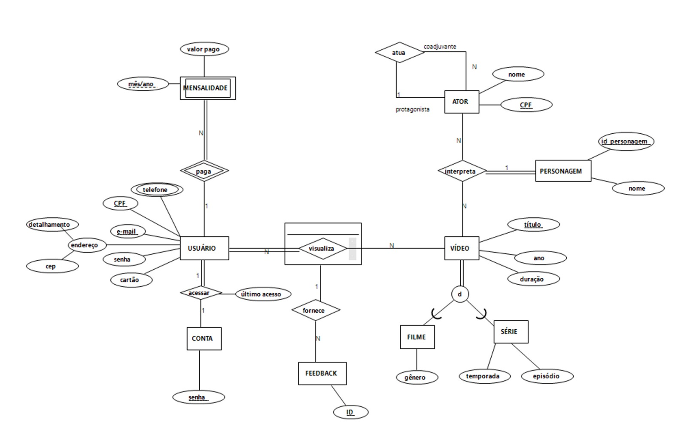

# repositorio-banco-de-dados
## Projeto de Banco de Dados 2022.2

### Minimundo
#
Usuários do Streaming serão cadastrados, devendo ser cadastrados pelo seu e-mail (login), senha, CPF, telefone endereço e informações de seu cartão de crédito. Logo em seguida o usuário terá que pagar uma mensalidade para utilizar o serviço de Streaming através de sua conta que será de apenas um usuário para evitar o repasse de contas. Ao acessar, o usuário poderá visualizar e avaliar os vídeos dando um feedback. Os vídeos podem ser de duas categorias: filmes ou séries.

Uma lista de atores será também mantida e associada ao catálogo de vídeos, de modo que o usuário possa procurar por atores e encontrar os vídeos. Os atores serão classificados como coadjuvantes e protagonistas que compõe o vídeo. Os atores interpretam apenas um personagem cada um assim como personagens são interpretados nos vídeos. Vídeos só podem ser filmes ou série e um vídeo não pode ser filme e série simutâneamente. Filmes possuem gêneros como Terror, Comédia, Ficção Científica, etc. Vídeo possui temporada e episódio.

A cada mês a cobrança da mensalidade será emitida, debitada do cartão de crédito do usuário cadastrado e confirmada via e-mail. Caso não seja possível realizar a cobrança (por exemplo, por bloqueio de cartão) o usuário será avisado por e-mail e a mensalidade ficará pendente. Com duas mensalidades pendentes, o usuário perderá o acesso ao serviço.

### Diagrama ERR
#

### Esquema Relacional
#
        1) CONTA(senha)

        2) USUÁRIO (CPF,[e-mail!], senha, cartão, cep, detalhamento, senha, [último_acesso!])

            senha → CONTA(senha)

        3) TELEFONE (CPF,telefone)

            CPF → USUÁRIO (CPF)
        
        4) MENSALIDADE (CPF, mês/ano, valor_pago)

            CPF → USUÁRIO(CPF)
        
        5) ATOR (CPF, nome, CPF_Prot)

            PF_Prot → ATOR(CPF_Prot)
        
        6) PERSONAGEM (ID_Personagem, nome)
        
        7) FEED-BACK (ID, CPF, título)

            CPF → VISUALIZA(CPF)

            título → VISUALIZA(título)
        
        8) VÍDEO (título, ano, duração)
    
        9) FILME (título, gênero)

            título → VÍDEO (título)

        10) SÉRIE (título, temporada, episódio)

            título → VÍDEO (título)
            
        11) VISUALIZA(CPF,titulo)

            CPF → USUÁRIO(CPF)

            titulo → VIDEO(titulo)
        
        12) INTERPRETA (CPF_Ator, título, [ID_Personagem!])

            CPF_Ator → ATOR (CPF_Ator)

            título → VÍDEO (título)

            ID_Personagem → Personagem(ID_Personagem)
